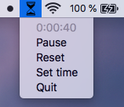

# Timeglass
Timeglass is a simple, unobtrusive menu bar timer for macOS. Rather than showing exact time in minutes and seconds, it visually represents time with a minimalistic hour glass icon in the menu bar.

## Installation
Download last version [here](https://github.com/mountwebs/timeglass/releases) and open it.

You might have to right click/control-click and select open if you get a warning that the app is from an unidentified developer. Move it to Applications if you want.

You can also build it yourself if you have pyinstaller installed. ("pyinstaller --onefile -w --add-data "Icons/:Icons" timeglass.spec".)

## Features
- Represents time with a simple icon.
- Set whatever time you want.
- Shows a simple alert with sound when time is up.
- Supports dark mode.

## Roadmap
- Adding a simple preference pane.
- Add ability to remove alert and/or sound.
- Add timeglass icon in alert.

Possible improvements:
- Add some time presets (and maybe let the user choose presets from preferences).
- Add shortkeys (see issue #2).
- Add pomodoro support (with auto breaks etc.).

## Contributions
Pull requests and suggestions are welcome! Write me a mail at mountwebs[at]gmail.com or open an issue if you have a suggestion for imrovement.

## About
Timeglass is made with [rumps](https://github.com/jaredks/rumps) and the app is built with [pyinstaller](https://github.com/pyinstaller/pyinstaller).

Read some feedback, praise and suggestions at [reddit](https://www.reddit.com/r/Python/comments/gf4boc/i_created_my_first_app_timeglass_a_simple/).

This is my first python "app". Feedback is appreaciated: mountwebs[at]gmail.com.

## License
[MIT](LICENSE)
