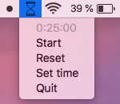

# Timeglass
Timeglass is a simple, unobtrusive menu bar timer for macOS. Rather than showing exact time in minutes and seconds, it visually represents time with a minimalistic hour glass icon in the menu bar.

Download [here](https://github.com/mountwebs/timeglass/releases). 

Or build it yourself: "pyinstaller --onefile -w --add-data "Icons/:Icons" --icon="Icons/timeglass.png" --clean timeglass.spec".

## About
Timeglass is made with [rumps](https://github.com/jaredks/rumps) and the app is built with [pyinstaller](https://github.com/pyinstaller/pyinstaller).

This is my first python "app". Feedback is appreaciated: mountwebs[at]gmail.com.
